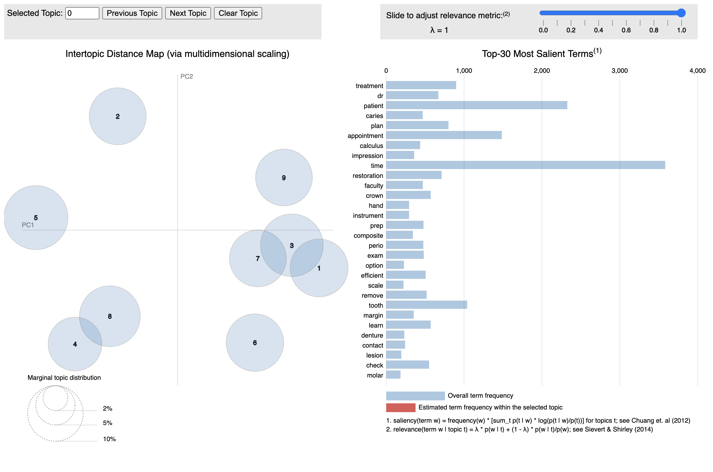

This workbook is heavily influenced by the tidy-data approach, code for 
a couple of the plots was lifted from Text Mining with R

The select on `dent_admin` is:
```
select response_date,
       response_id,
       response_value,
       IF(j.expected_grad_term_descr = 'WN 2022', 'D3', 'D4') as student_year,
       IF(ImportID='QID129_TEXT', 'differently', 'question') as question
from qx_clinic_feedback_stu_20_21 f
         left join student_canvas_umdw_join j on j.primary_email = f.student_email
where ImportId in ('QID129_TEXT', 'QID140_TEXT')

UNION

select qr.response_date,
       q.response_id,
       q.response_value,
       'D3' as student_year,
       IF(ImportID='QID129_TEXT', 'differently', 'question') as question

from qx_response_items q
         left join qx_responses qr on q.response_id = qr.response_id
         left join qx_surveys qs on qr.survey_id = qs.survey_id
where qs.name like '%aily%'
and ImportId in ('QID129_TEXT', 'QID140_TEXT');
```

```{r setup, message=FALSE, echo=FALSE}
library(tidyverse)
library(tidytext)
library(lubridate)
library(timetk)
library(tidyquant)
library(glue)
library(igraph)
library(ggraph)
library(textmineR)
library(LDAvis)
library(forcats)

interactive <- FALSE # makes timetk plots into ggplot not plotly objects
```

# Clean and Tidy Data

```{r import-shape}
raw_data <-
  read_tsv(
    'data/student_responses.tsv',
    skip_empty_rows = TRUE,
    col_names = TRUE,
    show_col_types = FALSE
  ) %>%
  pivot_wider(
    id_cols = c(response_date, response_id, student_year),
    names_from = question,
    values_from = response_value
  ) %>%
  mutate(academic_year = if_else(response_date < "2021-05-01", "2020-2021", "2021-2022"))

data(stop_words)

# for the time being, I'm only going to keep Differently because I think all the "thank you"
# that's in question might be overwhelming. Another approach (which I had in mind at first)
# would be to concatenate them.
# Taking D3s only

tidy_data <- raw_data %>%
  select(-question) %>%
  filter(student_year == 'D3') %>%
  rename(text = differently) %>%
  drop_na(text) %>%
  unnest_tokens(word,
                text,
                token = "ngrams",
                n = 1,
                n_min = 1)  %>%
  mutate(word = textstem::lemmatize_words(word)) %>%
  filter(length(word) > 1) %>%
  anti_join(stop_words) 

```

# Simple exploration
```{r}
tidy_data %>% count(word, sort = TRUE)  %>%
  filter(n > 600) %>%
  mutate(word = reorder(word, n)) %>%
  ggplot() +
  geom_col(aes(n, word)) +
  labs(y = NULL, title="Most Common Tokens Appearing in D3 Feedback")
```

How many responses do we have for each of the academic years we're looking at? 
2020-2021 only has Fall and Winter semesters, 2021-2022 has Spring/Summer and part
of Fall. Students are being graded on regular submissions this year, so I think 
there are more of them per semester than we had last year.

```{r}
tidy_data %>% group_by(academic_year) %>% distinct(response_id) %>% summarise(n=n())
```
Do the different cohorts worry about different things? (no, not really)

```{r, message=FALSE, warning=FALSE}
library(scales)

frequency <- tidy_data %>%
  count(academic_year, word) %>%
  group_by(academic_year) %>%
  mutate(proportion= n/sum(n)) %>%
  select(-n) %>%
  pivot_wider(names_from = academic_year, values_from = proportion) %>%
  pivot_longer("2020-2021", names_to="academic_year", values_to = "proportion")

ggplot(frequency, aes(x = proportion, y = `2021-2022`, 
                      color = abs(`2021-2022` - proportion))) +
  geom_abline(color = "gray40", lty = 2) +
  geom_jitter(alpha = 0.1, size = 2.5, width = 0.3, height = 0.3) +
  geom_text(aes(label = word), check_overlap = TRUE, vjust = 1.5) +
  scale_x_log10(labels = percent_format()) +
  scale_y_log10(labels = percent_format()) +
  scale_color_gradient(limits = c(0, 0.001), 
                       low = "darkslategray4", high = "gray75") +
  theme(legend.position="none") +
  labs(y = "2021-2022", x = "2020-2021", title="Frequency of Words in Dataset",
       subtitle = "For Different D3 Classes")
```
# Sentiment Analysis

```{r}
# note to self, look into medical sentiment lexicons
# for example here, in plain old NRC, 'patient' is a positive, whereas I think it's pretty neutral
# in our context

nrc <- get_sentiments('nrc')

#let's find most common positive words

tidy_data %>%
  inner_join(nrc) %>%
  filter(sentiment=='positive') %>%
  count(word, sort=TRUE) %>%
  top_n(10)
```

So this view of the bing sentiment analysis seems to indicate sinking positivity over time 
with a bit of a bump at the start of the new school year. Worth keeping an eye on but
also deserves more investigation into what terms are causing high or low.

I want to bring the negated tokens back in and flip their polarity in the next pass


```{r}
tidy_data %>%
  filter(!(word == 'patient')) %>% # patient is a happy verb in most of these lexicons
  inner_join(get_sentiments('bing')) %>%
  mutate(additive_sentiment = if_else(sentiment == 'negative',-1, 1)) %>%
  summarise_by_time(response_date,
                    .by = "week",
                    net_sentiment = SUM(additive_sentiment)/n()) %>%
  plot_time_series(response_date,
                   net_sentiment,
                   .interactive = FALSE,
                   .title = "Net Sentiment Within D3 Feedback" )
```

## Contributors to Sentiment

This plot really points out to me that we need to tune the sentiment lexicon better
to dental care. 

```{r, fig.height=4}
tidy_data %>%
  filter(!(word=='patient')) %>%
  inner_join(get_sentiments("bing")) %>%
  count(word, sentiment, sort = TRUE) %>%
  ungroup() %>%
  group_by(sentiment) %>%
  slice_max(n, n = 10) %>% 
  ungroup() %>%
  mutate(word = reorder(word, n)) %>%
  ggplot(aes(n, word, fill = sentiment)) +
  geom_col(show.legend = FALSE) +
  facet_wrap(~sentiment, scales = "free_y") +
  labs(x = "Contribution to sentiment",
       y = NULL, title="Most frequent contributors to positive and negative sentiment")
```

# NGrams

We'll explore bi-grams to get some context around these terms

```{r}
tidy_bigrams <- raw_data %>%
  select(-question) %>%
  rename(text = differently) %>%
  drop_na(text) %>%
  unnest_tokens(bigram, text, token = "ngrams", n = 2)  

# we should clean out stopwords

bigrams_separated <- tidy_bigrams %>%
  separate(bigram, c("word1", "word2"), sep = " ")

bigrams_filtered <- bigrams_separated %>%
  filter(!word1 %in% stop_words$word) %>%
  filter(!word2 %in% stop_words$word)

# new bigram counts:
bigram_counts <- bigrams_filtered %>% 
  count(word1, word2, sort = TRUE)
```

Students are loading the word "time" into so many of their comments. What context
are they using it in?

```{r}
bigrams_filtered %>%
  filter(word2 == "time") %>%
  count(word1, sort = TRUE) %>%
  filter(n > 2)
```

What about negation?

```{r}
AFINN <- get_sentiments('afinn')

negation_words <- c("not", "no")

negated_words <- bigrams_separated %>%
  filter(word1 %in% negation_words) %>%
  inner_join(AFINN, by = c(word2 = "word")) %>%
  count(word1, word2, value, sort = TRUE)

negated_words %>%
  mutate(contribution = n * value) %>%
  arrange(desc(abs(contribution))) %>%
  head(20) %>%
  mutate(word2 = reorder(word2, contribution)) %>%
  ggplot(aes(n * value, word2, fill = n * value > 0)) +
  geom_col(show.legend = FALSE) +
  facet_wrap(facets = vars(word1), nrow = 2, ncol = 2) +
  labs(x = "Sentiment value * number of occurrences",
       y = glue("Words preceded by negated word"))
```

In our dataset, "Not" is the ony real issue. Applying this, we might wish to specifically flip the polarity of 
some of these words.  

How are words connected to each other?

```{r}

# filter for only relatively common combinations
bigram_graph <- bigram_counts %>%
  filter(n > 45) %>%
  graph_from_data_frame()

ggraph(bigram_graph, layout = "fr") +
geom_edge_link(aes(edge_alpha = n, edge_width = n), edge_colour = "royalblue") +
  geom_node_point(size = 2) +
  geom_node_text(aes(label = name), repel = TRUE,
                 point.padding = unit(0.2, "lines")) +
  theme_void()
```


# Document Topic Modelling

```{r}
#create DTM

# This little dance is to try to collect only words that land in five or more documents

tidy_for_lda <- tidy_data %>%
  group_by(word) %>%
  mutate(doc_count = n_distinct(response_id)) %>%
  ungroup() %>%
  filter(doc_count > 5) %>%
  select(response_id, word) %>%
  count(response_id, word)

data_dtm <-  tidy_for_lda %>%
  cast_sparse(response_id, word, n)
```

How many topics is correct? Let's run a variety of models and identify
the value "K" that returns a model with the best coherence within its topics

```{r}
k_list <- seq(1, 20, by = 1)

model_dir <- paste0("models_", digest::digest(data_dtm, algo = "sha1"))
if (!dir.exists(model_dir)) dir.create(model_dir)

model_list <- TmParallelApply(X = k_list, FUN = function(k){
  filename = file.path(model_dir, paste0(k, "_topics.rda"))
  
  if (!file.exists(filename)) {
    m <- FitLdaModel(dtm = data_dtm, k = k, iterations = 500)
    m$k <- k
    m$coherence <- CalcProbCoherence(phi = m$phi, dtm = data_dtm, M = 5)
    save(m, file = filename)
  } else {
    load(filename)
  }
  
  m
}) 

#model tuning
#choosing the best model
coherence_mat <- data.frame(k = sapply(model_list, function(x) nrow(x$phi)), 
                            coherence = sapply(model_list, function(x) mean(x$coherence)), 
                            stringsAsFactors = FALSE)
ggplot(coherence_mat, aes(x = k, y = coherence)) +
  geom_point() +
  geom_line(group = 1)+
  ggtitle("Best Topic by Coherence Score") + theme_minimal() +
  scale_x_continuous(breaks = seq(1,20,1)) + ylab("Coherence")
```

```{r}
# manually picking nine topics because two is dumb and so is 19

# data_lda <- model <- model_list[which.max(coherence_mat$coherence)][[ 1 ]]
data_lda <- model <- model_list[9][[ 1 ]]


phi <-  as.matrix(data_lda$phi)
theta <- as.matrix(data_lda$theta)

doc.length <- tidy_for_lda  %>%
  count(response_id) %>%
  pull(n)

# create the JSON object to feed the visualization:
j <- createJSON(phi = phi, 
                   theta = theta, 
                   doc.length = doc.length, 
                   vocab = colnames(phi), 
                   term.frequency = colSums(data_dtm),
                reorder.topics=FALSE)

serVis(j, out.dir= 'vis', as.gist = FALSE)
```
The interactive D3 tool doesn't build output for the HTML rendering - here's a 
sample image:



Pulling relevance data back out of the JSON object so we can identify the words
in these topics that really help them make intuitive sense. I've found that a lambda
of about 0.5 seems to provide a useful balance between words exculsive to a topic
and straight-up prevalance.

```{r}
tinfo_df <- as_tibble(RJSONIO::fromJSON(j)$tinfo)
relevance <- function(lambda, logprob, loglift) {
    relevance <- lambda * logprob + (1-lambda) * loglift
    return(relevance)
}
tinfo_df <- tinfo_df %>%
  rowwise() %>%
  mutate(r0 = relevance(0, logprob, loglift),
         r1 = relevance(1, logprob, loglift),
         r05 = relevance(0.5, logprob, loglift),
         topic = if_else(Category == 'Default', 'Default',
                         str_replace(Category, 'Topic', 't_')))

```

Let's marry the topics and their original sentences back together to support a sanity check.

```{r}

viz_xref <-tibble(topic=rownames(phi), viz_topic = RJSONIO::fromJSON(j)$topic.order)

topic_labels <- as_tibble(as.matrix(phi), rownames = NA) %>%
  mutate(topic=rownames(phi)) %>%
  pivot_longer(cols= -topic, names_to='word', values_to='value') %>%
  left_join(tinfo_df[c('Term', 'topic', 'r05')],
            by = c('word' ='Term', 'topic' = 'topic')) %>%
  group_by(topic) %>%
  top_n(n=10, wt=r05) %>%
  summarise(label=paste(word, collapse = ' ')) %>%
  left_join(viz_xref)

labelled_responses <- as_tibble(as.matrix(theta), rownames = NA) %>%
  mutate(response_id = rownames(theta)) %>%
  pivot_longer(cols= -response_id, names_to='topic', values_to='value') %>%
  group_by(response_id) %>%
  top_n(n=1, wt=value) %>%
  inner_join(raw_data) %>%
  left_join(topic_labels)

readr::write_csv(labelled_responses, 'data/labelled_responses.csv')
```

Let's plot frequency of each of the topics over time - does it change? Do students worry about different things as they go along? 

```{r}
ts_topics <- labelled_responses %>%
  filter((response_date >= "2020-09-01" & response_date <="2022-05-01")) %>%
  select(response_date, response_id, viz_topic, label) %>%
  mutate(yr = year(response_date), wk = week(response_date)) %>%
  group_by(yr, wk) %>%
  mutate(response_wk = min(date(response_date)), period_count = n()) %>%
  group_by(viz_topic, label, .add=TRUE ) %>%
  summarise(percent_of_week = n()/period_count,response_wk = min(response_wk)) %>%
  ungroup() 

ts_topics$label <- factor(ts_topics$label)
ts_topics$label <- fct_reorder(ts_topics$label, ts_topics$viz_topic)
```

```{r}
ts_topics %>%
  ggplot(aes(x = response_wk, y = percent_of_week, fill = label)) +
  geom_area(position = position_identity(), alpha = .75) +
  theme_minimal() +
  geom_vline(xintercept=ymd("2021-05-01"), colour='grey') +
  theme(
    #legend.key.size = unit(1, 'cm'), #change legend key size
        #legend.key.height = unit(1, 'cm'), #change legend key height
        # legend.key.width = unit(1, 'cm'), #change legend key width
        #legend.title = element_text(size=14), #change legend title font size
        legend.text = element_text(size=6), #change legend text font size
    axis.text.y = element_blank()
  ) +
  scale_fill_brewer(palette = "Set3") +
  facet_grid(viz_topic ~ .) +
  labs(x = 'Week of Response Date', y = '',
       title = 'Prevalance of Themes Arising in Student Feedback Questions'
       )
  
```